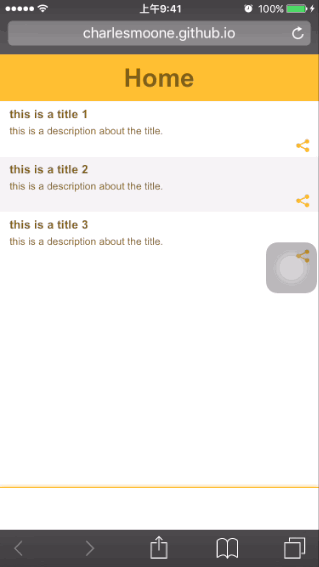

html5模拟原生app各项功能
---

本作品提供了一个用html5模拟原生app的各项功能的效果展示,首页可以模拟下拉刷新的效果。正在进行的测试是点击第一个滑出一个新页面,新页面可以滑动回去[测试中]

dome: https://charlesmoone.github.io/mobile-simulation

使用说明:请打开F12开发者模式-手机模拟,或者使用手机访问。

使用方法:加载页面,按住页面向下拉动,显示文字"在拉就加载给你看"全部显示,松开手可以看到显示文字是"哼,说加载就加载"即完成效果。

实现简介:
1. 将header与footer分离,article置底,监控article即可。
2. 滑动新页面则是创建一个新的iframe加载新页面,覆盖article,新增样式-webkit-overflow-scrolling: touch让iframe可以接受滚动请求,同时拒绝article的滚动。